# Gig-Prepper Arkitektur

> AI-driven ljudtekniker-assistent för att förbereda mixerkonsoler

**Senast uppdaterad:** 2024-12-14
**Version:** 2.0
**Status:** 133 tester passerar

---

## Innehåll

1. [Systemöversikt](#systemöversikt)
2. [Huvudflöde](#huvudflöde)
3. [AI Agent-arkitektur](#ai-agent-arkitektur)
4. [Verktygsflöden](#verktygsflöden)
5. [Adapter-system](#adapter-system)
6. [Streaming Chat](#streaming-chat)
7. [Datamodeller](#datamodeller)
8. [Saknade funktioner](#saknade-funktioner)

---

## Systemöversikt

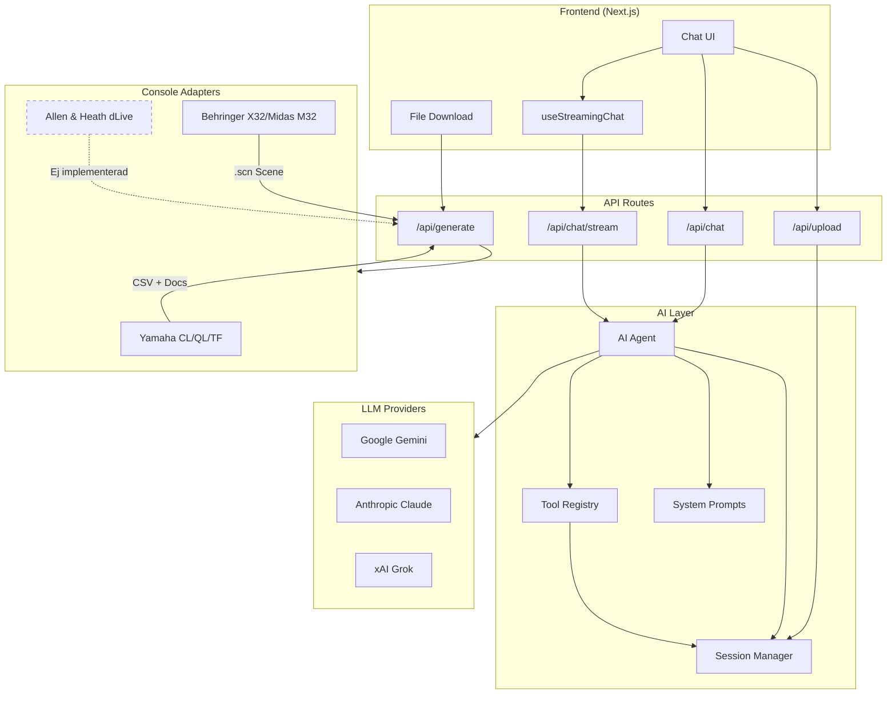

### Komponentöversikt

| Komponent | Plats | Ansvar |
|-----------|-------|--------|
| **SessionManager** | `memory/index.ts` | Session-livscykel, meddelandehistorik, preferenser |
| **runAgent** | `agents/index.ts` | LLM-anrop, verktygsexekvering |
| **Tool Registry** | `tools/index.ts` | Verktygsregistrering och uppslagning |
| **parse_rider** | `tools/parse-rider.ts` | Extrahera kanaler från PDF/bild |
| **build_mix** | `tools/build-mix.ts` | Skapa UniversalMix med genre presets |
| **suggest_settings** | `tools/suggest-settings.ts` | EQ/dynamik/effekt-rekommendationer |
| **generate_files** | `tools/generate-files.ts` | Adapter-anrop för filgenerering |
| **YamahaAdapter** | `adapters/yamaha/index.ts` | Yamaha CSV-export + markdown docs |
| **X32Adapter** | `adapters/x32/index.ts` | X32/M32 .scn scene-export |

---

## Huvudflöde

### Komplett användarresa

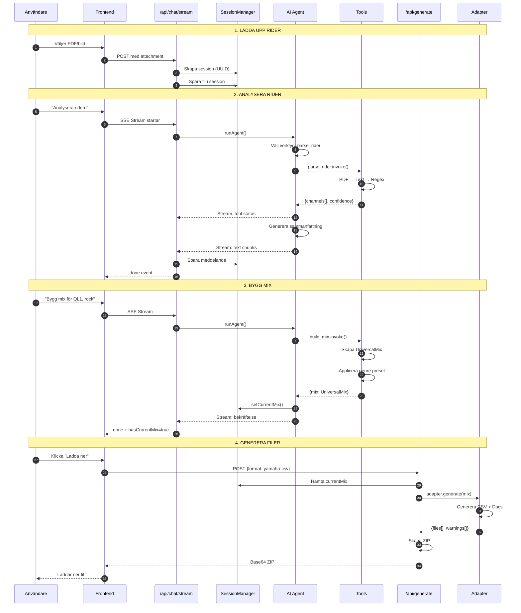

---

## AI Agent-arkitektur

### Verktygsval och exekvering

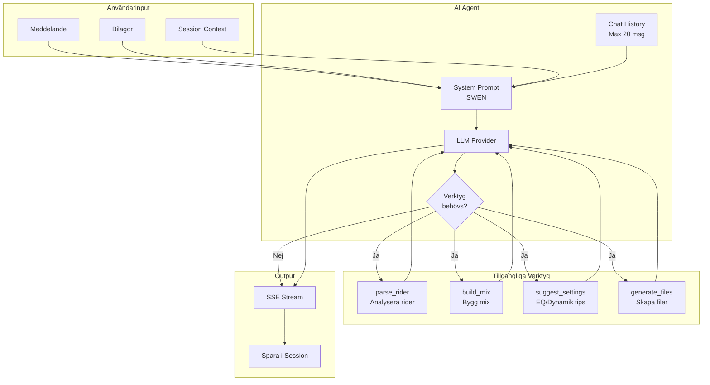

### Provider Fallback-kedja

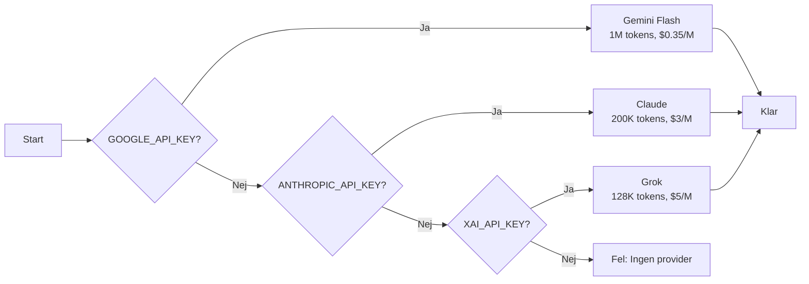

---

## Verktygsflöden

### parse_rider - Rideranalys

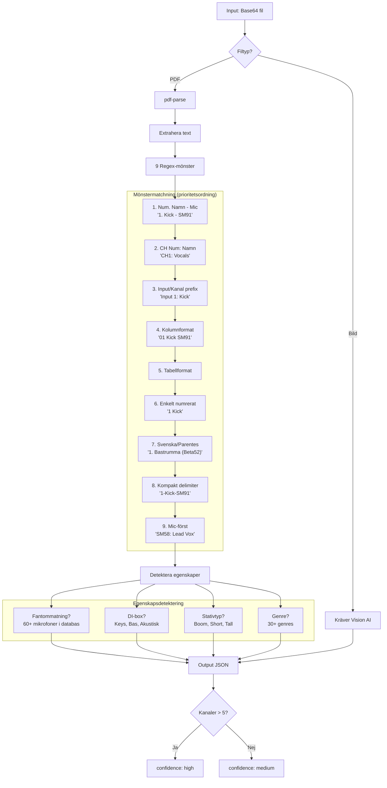

### build_mix - Skapa mix

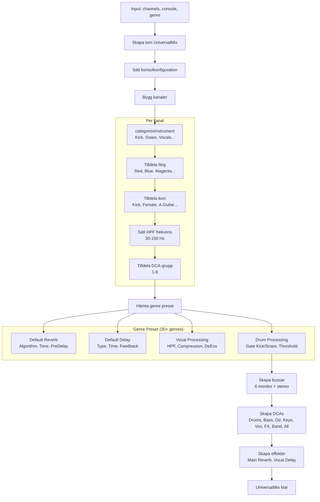

### Instrumentkategorisering

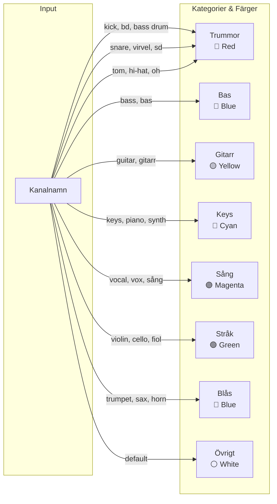

---

## Adapter-system

### Adapter-hierarki

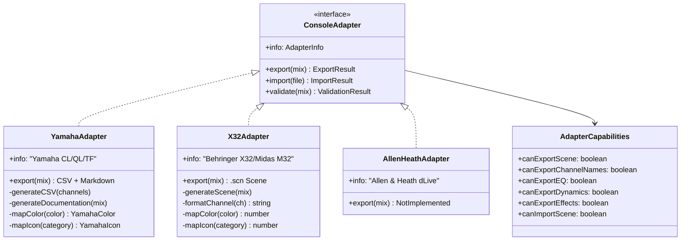

### Yamaha CSV Export

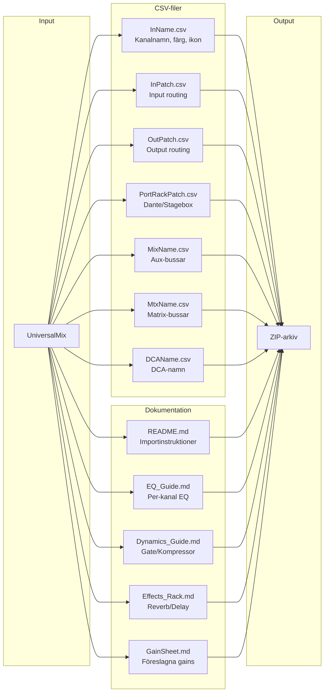

### X32 Scene Export

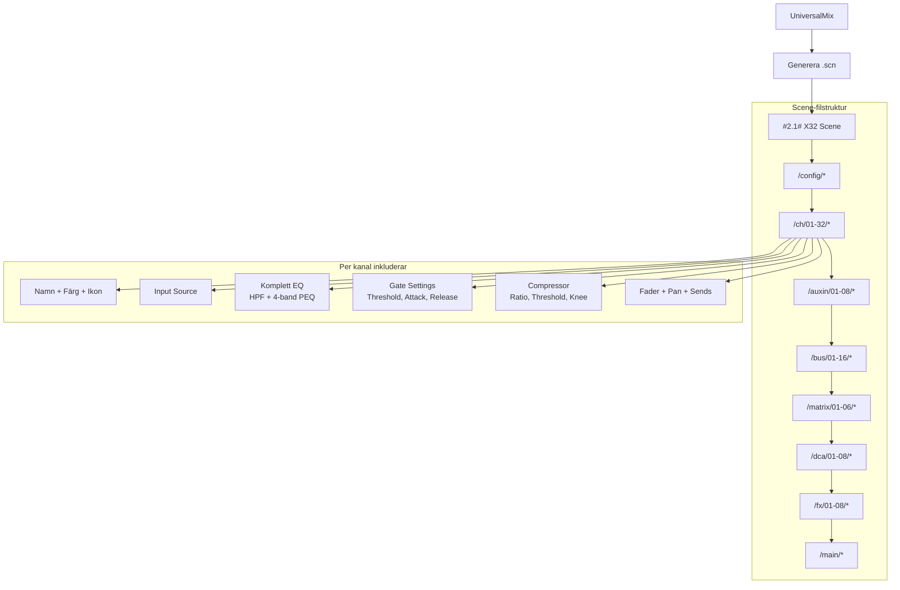

### Adapter-kapabiliteter

| Funktion | Yamaha CSV | X32 Scene |
|----------|:----------:|:---------:|
| Kanalnamn | ✅ | ✅ |
| Färger | ✅ | ✅ |
| Ikoner | ✅ | ✅ |
| Input Patching | ✅ | ✅ |
| EQ | ❌ (docs) | ✅ |
| Dynamics | ❌ (docs) | ✅ |
| Effects | ❌ (docs) | ✅ |
| DCA Assignments | ✅ | ✅ |
| Fader Levels | ❌ | ✅ |

---

## Streaming Chat

### SSE Event-flöde

```mermaid
sequenceDiagram
    participant C as Client
    participant S as Server
    participant A as Agent
    participant T as Tool

    C->>S: POST /api/chat/stream
    Note over S: Skapa ReadableStream

    S-->>C: event: session<br/>data: {provider, status: "starting"}

    S->>A: Initiera agent
    S-->>C: event: status<br/>data: {status: "thinking"}

    A->>A: LLM beslutar om verktyg

    alt Verktyg behövs
        S-->>C: event: tools<br/>data: {status: "executing", tools: ["parse_rider"]}

        A->>T: tool.invoke()
        S-->>C: event: tool<br/>data: {name: "parse_rider", status: "running"}

        T-->>A: Resultat
        S-->>C: event: tool<br/>data: {name: "parse_rider", status: "complete"}

        S-->>C: event: status<br/>data: {status: "summarizing"}
    end

    loop Stream text
        A-->>S: Text chunk
        S-->>C: data: {type: "text", content: "..."}
    end

    S-->>C: event: done<br/>data: {sessionId, toolsUsed, hasCurrentMix}

    Note over S: Stäng stream
```

### Client State Machine

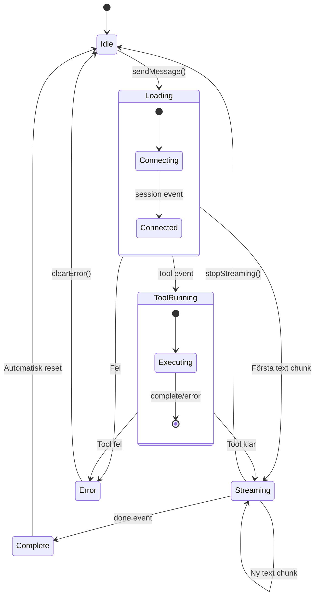

---

## Datamodeller

### UniversalMix struktur

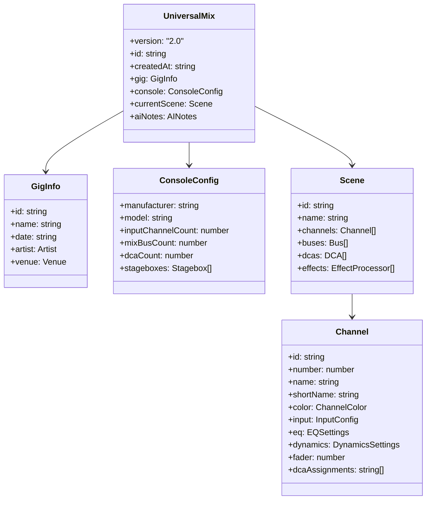

### Session State

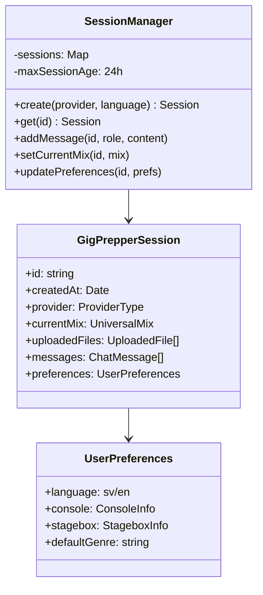

---

## Saknade funktioner

### Nuvarande status

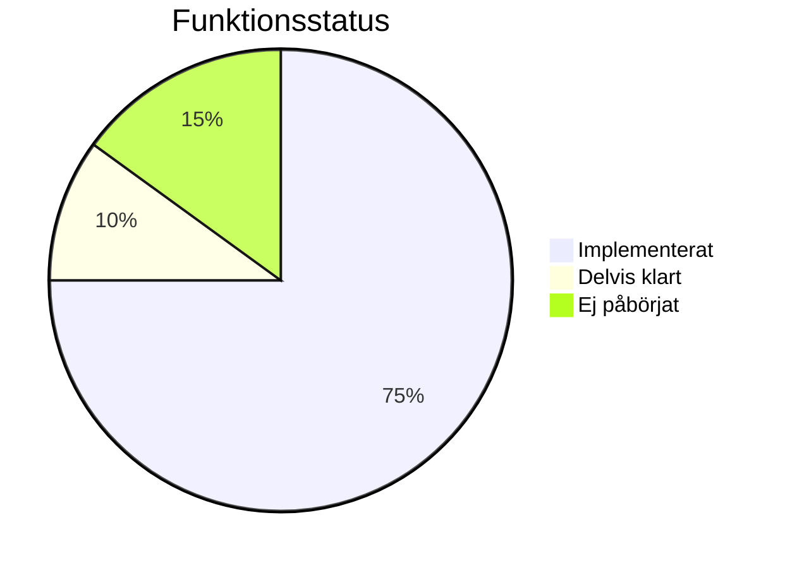

### Prioriterad roadmap

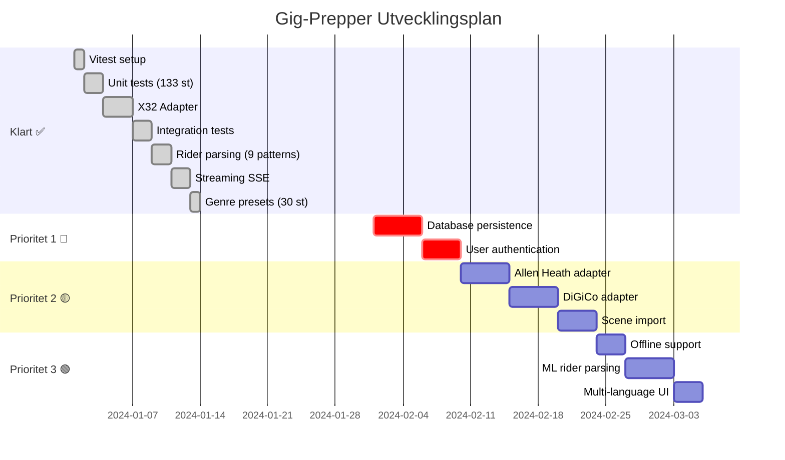

### Detaljerad lista

| Prio | Funktion | Beskrivning | Komplexitet |
|:----:|----------|-------------|:-----------:|
| **P1** | Database Persistence | PostgreSQL/SQLite för sessions | Medium |
| **P1** | User Authentication | NextAuth med OAuth | Medium |
| **P2** | Allen & Heath dLive | .showfile adapter | Hög |
| **P2** | DiGiCo SD-series | Session file adapter | Hög |
| **P2** | Scene Import | Läs in existerande konsolfiler | Hög |
| **P3** | Offline Support | Service worker + cached presets | Medium |
| **P3** | ML Rider Parsing | Tränad modell för komplexa riders | Hög |
| **P3** | OCR för handskrivna riders | Scannade dokument | Hög |

### Tekniska skulder

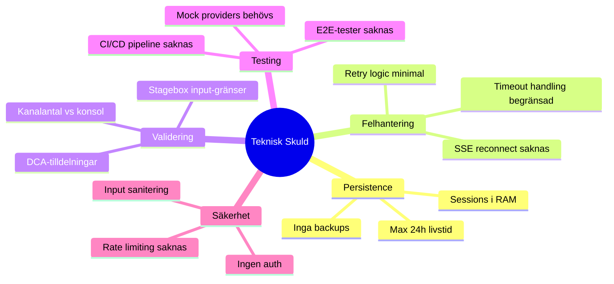

---

## Sammanfattning

### Styrkor

- ✅ **Komplett Yamaha CSV-export** med dokumentation
- ✅ **Full X32/M32 scene-export** med alla inställningar (EQ, dynamik, effekter)
- ✅ **Real-time streaming** med verktygsstatus
- ✅ **30+ genre presets** med svenska termer (dansband, schlager, etc.)
- ✅ **133 passerade tester**
- ✅ **9 rider-parsing mönster** med 60+ mikrofoner i databasen

### Svagheter

- ❌ Ingen persistent lagring (sessions försvinner vid omstart)
- ❌ Ingen användarautentisering
- ❌ Begränsat antal konsoladaptrar (2 av 4+)
- ❌ Ingen import-funktionalitet
- ❌ Ingen offline-support

### Filstruktur

```
src/
├── app/
│   ├── page.tsx              # Landing page
│   ├── chat/page.tsx         # Chat interface med streaming
│   └── api/
│       ├── chat/
│       │   ├── route.ts      # Standard chat endpoint
│       │   └── stream/route.ts # SSE streaming endpoint
│       ├── generate/route.ts # File generation
│       └── upload/route.ts   # File upload
├── hooks/
│   └── useStreamingChat.ts   # Streaming state hook
├── components/
│   └── chat/
│       ├── ChatMessage.tsx   # Message component
│       └── ChatInput.tsx     # Input with attachments
└── lib/
    ├── ai/
    │   ├── agents/index.ts   # Agent orchestration
    │   ├── tools/            # 4 AI tools
    │   ├── memory/index.ts   # Session management
    │   ├── prompts/system.ts # System prompts
    │   ├── providers/        # LLM abstraction
    │   └── config.ts         # Provider config
    ├── adapters/
    │   ├── yamaha/index.ts   # Yamaha CL/QL/TF
    │   └── x32/index.ts      # X32/M32
    └── models/
        └── universal-mix.ts  # Core data model + 30 genre presets
```
